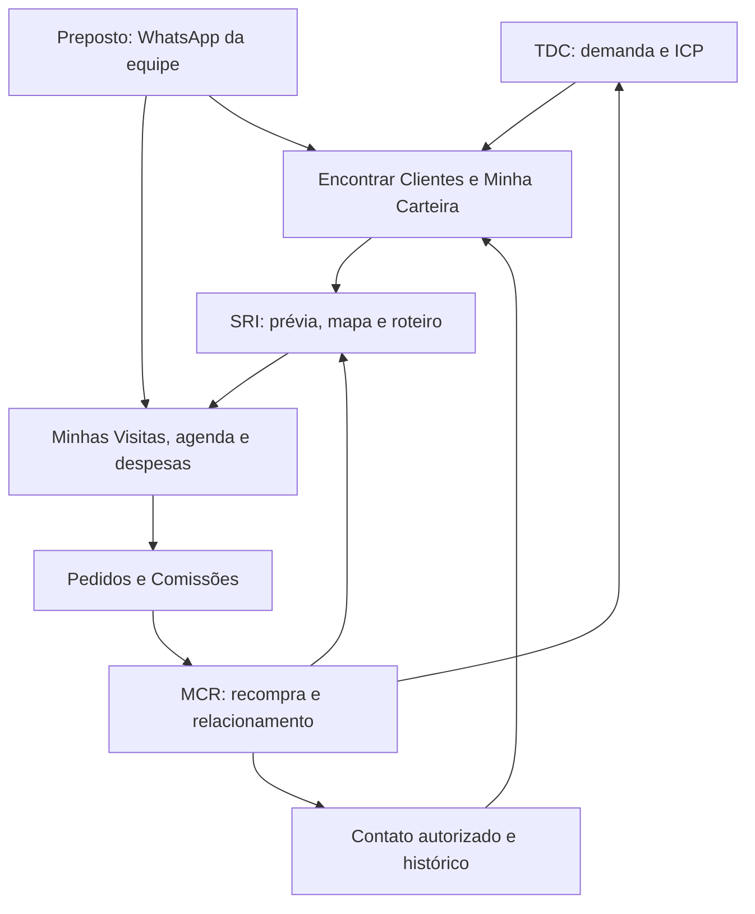

# L2 One — arquitetura integrada TDC, SRI, MCR e Preposto Virtual

Implementação sobre o FastAPI/PostgreSQL e o dashboard existentes. Revisão: 8 de outubro de 2026. Não exige migração para outro CRM nem cópia paralela da carteira. Os módulos compartilham identidades, permissões, eventos e transações do L2 One.

## Arquitetura e ciclo fechado



`server.py` mantém autenticação, autorização e sincronização. `strategic_crm.py` implementa TDC/SRI/MCR; `routing_engine.py` adapta a malha rodoviária OSRM; `field_assistant.py` implementa identidade e conversação do Preposto; `field_operations.py` acrescenta localização, despesas, lembretes com horário e indicadores de campo. `zara.py` recebe os webhooks assinados, deduplica mensagens e encaminha os números vinculados ao Preposto. `strategic_crm.js` acrescenta formulários e mapas às telas existentes; Leaflet 1.9.4 está versionado localmente, com licença.

As gravações de pedidos, visitas e contatos recalculam o MCR na própria transação. Uma compra elegível reinicia a cadência; rotas futuras preservam os compromissos e recebem a prioridade atualizada. O pedido também cria um sinal TDC com praça e perfil semelhante, vinculado ao pedido original. Cancelamento, arquivamento e restauração recalculam a carteira; sinais derivados de pedidos cancelados/arquivados são removidos. Alteração de cliente atualiza as duas carteiras afetadas.

Não há fila externa obrigatória: um worker executa a cada minuto enquanto o servidor está ativo. Registros de tentativa persistidos antes da chamada de rede evitam repetir disparos após reinício. Falhas ambíguas exigem conferência manual, pois aceitação pela Meta não comprova entrega.

## Fase 1 — TDC: necessidade real e perfil adequado

1. Abrir **Encontrar Clientes → TDC**. Buscar leads da base por PA/AP, segmento, urgência, porte e tag.
2. Consultar o CNPJ pela integração cadastral existente ou preencher os dados. A consulta cadastral não comprova intenção de compra.
3. Registrar razão social, CNPJ válido, cidade/UF, canal, CNAE, porte, potencial mensal estimado, segmento, urgência e evidência datada. Coordenadas, horários e tags personalizadas são opcionais, validados quando informados.
4. Calcular ICP: compatibilidade CNAE/canal vale 35 pontos; potencial >= R$ 2.000 vale 20, demais 5; urgência <= 14 dias vale 25, demais 10; evidência <= 7 dias vale 20, demais 10. Qualificação exige CNAE compatível e >= 70 pontos. Pesos são uma regra operacional inicial, não uma probabilidade estatística de conversão.
5. Evidência deve ter até 30 dias e não pode ser futura. Um lead qualificado entra em **Minha Carteira**, com status de prospecção e tag TDC. Um lead insuficiente permanece em análise. CNPJ deduplica a carteira e preserva a responsabilidade comercial existente; duplicidade prévia exige revisão.
6. Captação automática existente também aplica TDC quando `customFields` contém os campos obrigatórios. Tags, coordenadas e horários opcionais seguem as mesmas validações. Sem evidência ou responsável, fica aguardando qualificação.
7. **Praças e perfis derivados de pedidos** apresenta sugestões de pesquisa após compras reais. Um perfil semelhante nunca recebe demanda inventada nem é qualificado apenas por semelhança.

Contrato adicional de `customFields` no endpoint de captação existente:

```json
{
  "channel": "Cosméticos", "cnae": "4772500", "size": "Pequena",
  "segment": "Maquiagem", "demandEvidence": "Comprador solicitou reposição em contato registrado.",
  "evidenceDate": "2026-10-08", "urgencyDays": 7,
  "estimatedMonthlyValue": 3000, "tags": ["Reposição urgente"],
  "latitude": -1.4558, "longitude": -48.4902,
  "opens": "09:00", "closes": "18:00"
}
```

A descoberta consulta a base captada pelo L2 One. A integração Speedio existente consulta CNPJ; não oferece uma fonte autenticada de busca externa por demanda. Ampliação da base depende de conectar uma fonte de prospects, com contrato de acesso e evidências, ao endpoint de captação. Essa dependência não foi simulada como descoberta externa ativa.

## Fase 2 — SRI: rotas temporárias e roteiros publicados

1. Em **Rota → Planejar visitas**, salvar coordenadas, abertura/fechamento e dias fechados. Usar geolocalização apenas pelo botão **Usar minha localização**, com autorização do navegador.
2. Informar data, cidade/UF, origem, início, retorno limite, quantidade de visitas (1–10), duração por visita e custo estimado/km.
3. Selecionar estimativa geográfica ou malha rodoviária. O modo geográfico usa Haversine, fator 1,4 e média de 25 km/h. O modo rodoviário usa matriz OSRM de distâncias e durações, limitada aos 40 candidatos de maior prioridade; os demais aparecem como pendência. Coordenadas sem conexão viável não geram visitas.
4. O planejador usa prioridade MCR, ICP recente, queda de volume e cliente quente, descontando tempo de deslocamento. Respeita horários, tempo de visita, dias fechados e retorno. É uma heurística, sem garantia matemática de ótimo global e sem trânsito em tempo real. Balsas, feriados específicos e intervalos de almoço exigem conferência operacional.
5. Gerar uma **Rota Temporária**, válida por 24 horas. Revisar mapa, ordem, chegada/saída, status cadastrado e motivos de exclusão. Linhas tracejadas indicam conexão geográfica; geometria rodoviária é fornecida quando disponível. Falha do provedor rodoviário retorna indisponibilidade; não é ocultada como cálculo rodoviário válido.
6. Publicar explicitamente o roteiro. O servidor revalida propriedade, carteira, data, coordenadas e horários. Mudança cadastral exige recalcular. Publicação repetida é idempotente; roteiro já existente para operador/data bloqueia duplicação. Rotas publicadas alimentam a agenda e **Minhas Visitas**, sem criar uma visita realizada fictícia.
7. Atalhos para **Waze, Google Maps, WhatsApp e Ligar** aparecem nos pontos e cartões da rota. Telefone inválido não recebe link de contato.
8. Registrar despesa realizada por ponto do roteiro. A API aceita apenas rota própria, valor positivo finito e descrição. Cria registro de despesa e ação de conferência operacional para Marlene. Previsão/km e despesa enviada para conferência não são contabilizadas como pagamento ou lançamento de caixa.
9. A publicação cria uma confirmação pendente do Preposto, enviada somente se o operador estiver vinculado e os envios estiverem configurados e ativados.

Mapa usa Leaflet local e tiles OpenStreetMap com atribuição visível, Referer de origem, cache normal do navegador e sem download offline ou prefetch. O mapa e o OSRM público não possuem disponibilidade garantida. Para capacidade comercial contratada, configurar um servidor OSRM por `L2_ROUTING_URL` e adaptar o provedor de tiles conforme contrato.

## Fase 3 — MCR: organização, cadência e retenção

1. Em **Hoje / CRM / Crescimento → Acompanhamento e reativação**, consultar prioridade e próximo contato por cliente.
2. Compras elegíveis são pedidos confirmados, faturados ou entregues, com data válida até hoje. Rascunhos, orçamentos, cancelados, arquivados e futuros não contam. Sem compra registrada: **Sem histórico**, nunca inativo. **Ativo**, **Em risco** (>= 15 dias ou além do ciclo observado) e **Inativo** (>= 60 dias) seguem as regras comerciais iniciais.
3. Três datas distintas de compra permitem estimar recompra pela mediana dos intervalos, limitada a 7–180 dias. Com amostra insuficiente, o ciclo padrão de 30 dias fica identificado. A API também apresenta ciclos por marca.
4. Detectar queda de volume: faturamento dos últimos 30 dias < 50% da média mensal dos 60 dias anteriores, com ao menos dois pedidos na base de comparação. A queda aumenta prioridade em 15 pontos; cliente quente aumenta em 20. Valores ausentes/inválidos não viram faturamento fictício.
5. Último contato ou compra mais recente gera próximo contato em sete dias. Criar/atualizar um lembrete determinístico por cliente, preservando conclusão quando a data não mudou. Ligações e contatos registrados alimentam o histórico e a cadência; lembretes permanecem na agenda existente.
6. Registrar autorização/suspensão do WhatsApp com evidência. Somente Ana Paula/Euler ativam a cadência e escolhem modelo aprovado com duas variáveis: nome e segmento.
7. Worker atende contatos vencidos em dias úteis, 9h–18h de Belém, somente com autorização e provedor configurado. Reserva uma tentativa durável por cliente/data. O histórico distingue tentativa, aceitação, entrega e leitura; falha ambígua exige revisão.

O total de compras registradas é uma medida histórica. Não se apresenta uma previsão de LTV ou churn estatístico sem dados e modelo calibrado. A arquitetura suporta retenção e recompra sem inventar projeções.

## Fase 4 — Preposto Virtual: identidade e conversação

1. Ana Paula/Euler vinculam o número brasileiro com DDD a um usuário comercial ativo, em **Hoje → Preposto Virtual**. Um telefone pertence a apenas um operador. Troca/suspensão remove a sessão pendente. Números não vinculados continuam no atendimento Zara existente.
2. O webhook verifica assinatura HMAC e identificador do número empresarial antes do encaminhamento. Mensagem duplicada não gera novo registro. O Preposto consulta apenas carteira e roteiro autorizados do operador.
3. Comandos de campo:

| Mensagem | Efeito |
|---|---|
| `agenda hoje`, `agenda amanhã`, `agenda 2026-10-09` | Pontos próprios, horários e links de navegação |
| `resumo hoje` | Visitas próprias, com/sem pedido, ausentes e pontos sem registro |
| `visita NOME ou CNPJ: pedido realizado` | Preparar visita com pedido; pedir confirmação |
| `visita NOME: sem pedido` | Preparar visita sem pedido; pedir confirmação |
| `visita NOME: cliente ausente` | Preparar ausência e retorno no dia seguinte |
| `cliente quente NOME` | Preparar oportunidade, tag e prioridade comercial |
| `1` a `10` | Resolver clientes homônimos na carteira |
| `CONFIRMAR` | Gravar apenas a ação pendente e revalidar acesso |
| `CANCELAR`, `ajuda`, `menu` | Encerrar ação ou apresentar orientação |

4. Observação opcional: `visita Alfa: sem pedido; comprador retorna amanhã`. O reconhecimento normaliza maiúsculas/acentos; a entrada original permanece no histórico da Zara. Sessão guiada expira em 15 minutos. Comando desconhecido apresenta ajuda; não executa ação inferida.
5. A confirmação grava visita/contato/oportunidade, atualiza atendimentos, tarefa de retorno, roteiro do dia, MCR e auditoria na mesma transação. Identificadores determinísticos vinculados à mensagem evitam repetição. A carteira é conferida novamente no momento da confirmação.
6. **Pedido realizado** é resultado da visita. Não cria valor, faturamento, número de pedido ou comissão. Esses dados vêm do registro efetivo em **Pedidos e Comissões**.
7. Notificações automáticas exigem credenciais e modelo aprovado com duas variáveis: nome do operador e texto de agenda/resumo. Há confirmação de roteiro, agenda diária 8h–10h e resumo 18h–20h, em dias úteis de Belém. Envios começam desativados; apenas números vinculados e contas ativas recebem. Um resumo/agenda por operador/data e uma confirmação por roteiro; tentativa ambígua não é repetida automaticamente.

A conversação usa interpretação determinística e confirmação guiada. Não depende de um modelo generativo nem concede a IA acesso irrestrito ao banco. Uma futura interpretação por LLM deve produzir somente intenções tipadas permitidas, preservar a mesma confirmação e autorização e ser homologada antes de ativação.

## Dados e contratos de integração

| Registro | Persistência / integração |
|---|---|
| Cliente / lead | `entities`: `client`, `lead`; projeção existente `clientes` |
| Inteligência comercial | `client.tdc`, `client.mcr`, `client.mcrConsent`, `fieldTemperature`; campos derivados protegidos na sincronização |
| Prévia / roteiro | `temporary_route` com expiração; `route` com operador, data, horário, prioridade e vínculo da prévia |
| Despesa | `route_expense` + `office_action` para conferência |
| Relacionamento | `visit`, `interaction`, `opportunity`, `task`; projeção `atendimentos` |
| Busca semelhante | `tdc_signal` vinculado ao pedido, removido na invalidação |
| Configuração / envios | `strategy_settings`, `strategy_send`, `field_notice`, `field_send` |
| Conversação de campo | `field_operators`, `field_sessions`, `field_events` |
| WhatsApp existente | `zara_conversations`, `zara_messages`, `zara_delivery_events` |

Todas as APIs estratégicas exigem Bearer token e permissões setoriais existentes. Configuração de operadores e de envios é exclusiva dos sócios; vendedores não acessam carteira alheia. Notificações de alterações usam `pg_notify('l2_records_changed', '')` e o canal existente de atualização, sem recarregar página. Formulários validam tipos e limites no navegador; servidor revalida regras, autorização e conflitos antes do commit.

| API sob `/api/strategy` | Uso |
|---|---|
| `POST /tdc/qualify`, `GET /tdc/discover`, `GET /tdc/signals` | Qualificar, filtrar leads e pesquisar perfis derivados |
| `PUT /sri/location/{client_id}`, `POST /sri/plan` | Cadastro geográfico e planejamento |
| `GET /sri/temporary`, `POST /sri/temporary/{id}/publish` | Prévia durável e publicação idempotente |
| `POST /sri/expenses`, `GET /sri/expenses` | Despesa realizada para conferência |
| `GET /overview`, `POST /mcr/refresh` | Prioridades, ciclos e atualização de lembretes |
| `GET/PUT /mcr/settings`, `PUT /mcr/consent/{client_id}`, `GET /mcr/history` | Configuração, autorização e auditoria de mensagens |
| `GET/PUT /field/operators`, `GET/PUT /field/settings` | Identidade e envio do Preposto |
| `GET /field/events`, `GET /field/history` | Ações confirmadas e histórico de notificações |

## Implantação passo a passo

### 1. Preparar e conferir configuração

Usar o repositório e serviço já existentes. Variáveis sensíveis ficam exclusivamente no gerenciador de ambiente, nunca em código ou chat. Preservar `DATABASE_URL`, senhas e demais configurações atuais.

```bash
python -m pip install -r requirements-dev.txt
python scripts/strategy_deploy.py check
python -m py_compile server.py strategic_crm.py routing_engine.py field_assistant.py field_operations.py
python -m unittest discover -s tests -p 'test_*.py' -v
node --check app.js
node --check strategic_crm.js
npm install --prefix /tmp/l2-test-dom jsdom --no-audit --no-fund
L2_JSDOM=/tmp/l2-test-dom/node_modules/jsdom node tests/strategic_crm_dom.cjs
python scripts/zara_e2e_mock.py
```

`check` é somente leitura, não conecta ao banco e não envia mensagens. Mostra apenas presença de configuração e hostname do roteador, sem segredos. Configuração opcional OSRM: `L2_ROUTING_URL` com HTTPS, sem credenciais na URL. O padrão é o endpoint público de demonstração.

### 2. Aplicar migração aditiva

```bash
python scripts/strategy_deploy.py migrate
```

Exige banco existente com `entities` e `app_users`. Cria índice e três tabelas de campo com `IF NOT EXISTS`, sob lock transacional. Não altera pedidos, senhas ou carteira, não vincula números e não ativa disparos. A inicialização normal do serviço executa a mesma migração automaticamente.

### 3. Publicar a versão

Após CI aprovado, integrar em `main`. O serviço Render existente usa o autodeploy do repositório. Comando local equivalente:

```bash
uvicorn server:app --host 0.0.0.0 --port "$PORT"
```

Conferir `/health`, assets `strategic_crm.js`, `leaflet.js`, `leaflet.css`, e retorno 401 das APIs estratégicas sem autenticação. Conferir logs de inicialização, migração e worker. O PWA usa nova versão de cache; dados operacionais continuam nos mesmos registros.

### 4. Homologar as fases na ordem

TDC: qualificar lead real com evidência e confirmar ausência de duplicação. SRI: atualizar localização, criar prévia, revisar horários e publicar em dia sem roteiro prévio. MCR: registrar contato e pedido real autorizado, conferir próximo contato, prioridade e perfil derivado. Preposto: vincular um número de teste da equipe, enviar mensagem assinada pela Meta, conferir cliente, confirmar visita e verificar carteira/histórico/rota. “Pedido realizado” não deve gerar faturamento fictício.

A suíte atual cobre 193 testes Python, além de testes JavaScript comerciais e simulação DOM para cinco perfis. Protocolos WhatsApp e malha rodoviária são testados com provedores simulados; entrega em aparelho e percurso real precisam de homologação externa.

### 5. Habilitar integrações externas

WhatsApp outbound compartilhado: `WHATSAPP_ACCESS_TOKEN`, `WHATSAPP_PHONE_NUMBER_ID`, `WHATSAPP_GRAPH_VERSION` (versão suportada configurada explicitamente). Webhook Zara: `WA_VERIFY_TOKEN`, `WA_APP_SECRET`, `WA_PHONE_NUMBER_ID`, `WA_ACCESS_TOKEN` ou aliases `WHATSAPP_*` já suportados pelo módulo. Manter o identificador do mesmo número empresarial. Registrar `/api/zara/webhook` e a inscrição de mensagens pelo fluxo Meta existente. Usar templates aprovados e seus idiomas exatos. Preposto e MCR possuem configurações independentes, ambos inicialmente desativados.

No dashboard, vincular operadores, registrar preferências dos clientes, selecionar templates e ativar apenas após teste de entrega/leitura. Não confundir aceitação Graph com recebimento no aparelho.

### 6. Operação contínua e recuperação

O worker embutido executa enquanto o web service está ativo. Plano gratuito que suspende por inatividade não garante cadências nos horários definidos. Para execução contínua, usar serviço sem suspensão ou agendador já contratado com o comando:

```bash
python scripts/strategy_deploy.py tick
```

Executar uma vez por minuto no ambiente configurado; reservas e locks impedem duplicação se houver mais de um executor. O comando pode enviar somente fluxos já ativados; não é um diagnóstico somente leitura. Não foi criado recurso pago adicional. Medir falhas, atrasos e confirmações pelos históricos; revalidar coordenadas e horários periodicamente.

Rollback: reverter o commit de aplicação e publicar novamente. Tabelas e registros aditivos podem permanecer; não apagar carteira ou eventos para voltar a versão. Desativar MCR e notificações de campo antes de suspender uma integração externa. Falha de mapas mantém consulta de carteiras e permite escolher explicitamente estimativa geográfica.

## Referências técnicas dos adaptadores

- [OSRM: Table e Route](https://project-osrm.org/docs/v5.24.0/api/).
- [Google Maps URLs](https://developers.google.com/maps/documentation/urls/get-started).
- [Waze Deep Links](https://developers.google.com/waze/deeplinks/).
- [Leaflet 1.9.4](https://leafletjs.com/reference.html).
- [Política de tiles OpenStreetMap](https://operations.osmfoundation.org/policies/tiles/).
- [WhatsApp Cloud API](https://developers.facebook.com/docs/whatsapp/cloud-api/).


## Ampliação logística — localização, combustível e Agenda

### Receber posição e encontrar clientes próximos

O webhook assinado aceita mensagens WhatsApp `type=location`, valida coordenadas finitas e limites geográficos e encaminha apenas operadores vinculados. A posição é salva como `field_location` por usuário, com data/hora, e fica válida para consulta por quatro horas. Não muda automaticamente coordenadas de clientes.

`perto` ou `perto cosméticos` lista até dez clientes autorizados no PA/AP, com coordenadas e até 50 km em linha reta. O segmento corresponde ao canal ou segmento já registrado no TDC; a proximidade não comprova demanda e não cria prospect externo. Para planejamento rodoviário, usar SRI/OSRM. `localizar NOME ou CNPJ` prepara a atualização do cadastro pela posição atual, resolve homônimos, exige `CONFIRMAR` e confere novamente a carteira. Prévia com posição antiga exige recálculo ao publicar.

### Registrar despesa pelo WhatsApp

`despesa combustível R$ 183,00` ou `despesa transporte 183.00` prepara valor e descrição; `CONFIRMAR` grava `route_expense` e `office_action` para Marlene. Valor deve ser positivo, finito, até R$ 100.000 e com até duas casas decimais. Uma única rota própria no dia permite vínculo automático; com múltiplos pontos, a despesa fica como despesa geral de campo, sem atribuição arbitrária a um cliente. A mensagem repetida não duplica a despesa. O lançamento fica para conferência operacional e não vira pagamento de caixa.

### Criar e entregar lembretes com horário

- `lembrete em 30 min: ligar para cliente Alfa`.
- `lembrete amanhã 09:00: ligar para cliente Alfa`.
- `lembrete 2026-10-09 09:00: conferir combustível`.

O servidor interpreta no fuso `America/Belem`, limita a um ano futuro, resolve o cliente quando há ligação e exige confirmação. Cria uma tarefa real com `date`, `time`, `dueAt`, responsável, texto e status. Tarefas gerais sem cliente são visíveis ao próprio vendedor. A tela CRM e a Agenda de campo exibem o horário; concluir, editar ou excluir usa a sincronização existente. Visitas publicadas e tarefas aparecem juntas em `GET /api/strategy/field/agenda?day=AAAA-MM-DD` e no comando `agenda hoje`.

Com integração e notificações habilitadas, o worker reserva dois avisos por tarefa: até 30 minutos antes e no horário. Lembretes com horário são avaliados todos os dias, inclusive fora da janela da agenda diária. O ciclo tem resolução de um minuto e processa até quatro notificações por rodada; entrega exata depende do servidor ativo, da fila e da Meta. Aviso do horário atrasado em mais de 15 minutos não é disparado como pontual. Tarefa concluída deixa de gerar reservas. Alterar data, hora ou texto gera uma chave nova; tarefas editadas no CRM usam os campos atuais, sem depender de um `dueAt` antigo. Uma tentativa ambígua exige conferência e não é repetida.

Agenda/resumo diários continuam na janela de dias úteis. Modelos aprovados e credenciais permanecem obrigatórios. Nenhum envio é ativado apenas pela implantação do código.

### Medir visitas sem pedido e custos com dados reais

`GET /api/strategy/field/productivity?start=AAAA-MM-DD&end=AAAA-MM-DD` aceita período até hoje, limitado a 93 dias. O painel **Eficiência em campo** apresenta visitas presenciais com/sem pedido imediato, cliente ausente, percentual de visitas com pedido, despesas submetidas e cobertura de dados. Contato remoto fica fora do denominador de visitas de campo. Vendedores usam atendimentos próprios e despesas próprias; consultas administrativas respeitam as permissões comerciais existentes.

Tempo observado só aparece quando `checkIn` e `checkOut` válidos existem. Deslocamento e quilômetros dos pontos são planejamento, sem retorno da rota incluído nessa soma. Despesas são valores informados, não necessariamente pagamentos aprovados. Não se multiplica visita sem pedido por um custo arbitrário, não se inventa venda perdida, não se promete economia comprovada e não se trata toda visita sem pedido como desperdício: relacionamento, negociação e pós-venda podem justificá-la. As cifras das referências são exemplos conceituais, não dados da L2.

### Validação e implantação desta ampliação

A migração anterior já fornece as tabelas de conversação; `field_location`, despesas e tarefas usam a persistência existente. Nenhuma tabela adicional, fornecedor pago ou credencial é criada. Executar os mesmos comandos de `strategy_deploy.py check`, CI e publicação em `main`. A suíte acrescenta moeda brasileira, datas relativas, confirmação de despesas, autorização de geolocalização, deduplicação, duas fases de lembretes, cancelamento, reagendamento, indicadores sem perda fictícia e localização recebida por webhook assinado. A ampliação visual e de áudio descrita abaixo acrescenta transcrição opcional com confirmação por texto.


## Dashboard integrado e áudio — implantação por fase

### 1. Identidade visual e TDC

`strategy_ui.css` mantém o cabeçalho e logotipo L2 existentes, acrescentando painel claro, cards em três colunas, faixas de cor por função, bordas suaves e adaptação para celular. A composição reproduz a organização das referências; cores do destaque principal usam petróleo e verde da L2. O dashboard preserva métricas, tarefas e pedidos existentes.

Abertura: **Hoje → Encontrar Clientes**. O TDC aparece antes da carteira, com etapas **1. Local → 2. Segmentos → 3. Buscar**. Botões verificam campos da etapa; busca final passa UF, cidade, segmento/produto, urgência, CNPJ, porte e tag à API. Cards retornam nome, cidade, CNPJ, aderência ao ICP, situação da evidência e link para a carteira. Qualificação continua transacional: CNPJ válido, demanda recente, perfil aderente e deduplicação por CNPJ. Qualificados são salvos automaticamente na mesma carteira, sem cópia separada. Sem fonte de prospecção externa configurada, a busca consulta os leads capturados na base L2.

### 2. SRI e roteiro visual

Abertura: **Hoje → Rotas Temporárias**. O planejador aparece antes das rotas manuais existentes. O resultado combina mapa, cards dos pontos e tabela com ordem, cliente, chegada, saída, distância e minutos do trecho. Os horários são estimados pela malha rodoviária ou pelo modo geográfico explicitamente escolhido; não representam trânsito em tempo real. Status usa horário cadastrado, sem afirmar observação física da loja. Maps, Waze, WhatsApp e telefone usam dados do cliente; Registrar Visita abre o atendimento existente e Agendar Retorno abre o acompanhamento para criar a tarefa. Publicar o roteiro cria registros da agenda sem registrar visitas realizadas. Distâncias não atravessam rios por aproximação quando o modo rodoviário está selecionado: falha ou ausência de caminho exige revisão.

### 3. MCR e filtros de carteira

Abertura: **Hoje / CRM → Acompanhamento e reativação → Consultar prioridades**. Contadores: totais, ativos, em risco, inativos e com tags. Clicar num contador filtra a tabela; clicar numa tag combina o filtro de situação e tag. Sem histórico continua explicitamente identificado, não incluído artificialmente nos ativos. Tags são escapadas e não executam HTML. Próximo contato, ciclo, origem do ciclo e queda de volume vêm da API autorizada. Nenhum contador representa LTV ou economia estimada sem modelo de margem e amostra válida.

### 4. Preposto: conversa e transcrição opcional

**Abrir conversa de campo** consulta somente o WhatsApp vinculado ao usuário autenticado. Mensagens recebidas e enviadas aparecem em balões, com data e disponibilidade das integrações. Não é uma simulação de conversa nem uma ação de enviar mensagem.

`field_audio.py` recebe somente mídias de webhook assinado e de operador comercial ativo vinculado. Antes da rede, reserva a mensagem em `entities(kind='field_audio')`; reserva repetida não faz outra chamada de transcrição. Limite de 30 reservas por operador/dia, entrada até 6 MB e gravação até 90 segundos. A URL de mídia deve ser HTTPS em host Meta permitido, sem redirecionamentos nem credenciais embutidas. Arquivos OGG/Opus do WhatsApp são convertidos para WAV mono/16 kHz por FFmpeg, executado em diretório temporário com timeout. Áudio bruto não fica armazenado no banco. Transcrição é persistida antes de processar o comando.

A transcrição usa `POST https://api.openai.com/v1/audio/transcriptions`, multipart, idioma `pt`, modelo configurável. Modelo padrão: `gpt-4o-mini-transcribe`. Formatos de áudio e API: [documentação oficial](https://developers.openai.com/api/docs/guides/speech-to-text).

Exemplos de voz: “visita Loja Alfa sem pedido”, “despesa combustível R$ 100,00”, “agenda hoje”. O primeiro prepara uma visita; o segundo prepara despesa; ambos exigem **CONFIRMAR por texto**. Voz não confirma, cancela ou escolhe um cliente por número. Comando ambíguo ou não reconhecido pede reformulação; a transcrição não pode criar pedido, valor de faturamento ou comissão. Valores monetários por extenso que o parser não reconheça exigem texto, sem estimativa automática. Localização usa mensagem de localização suportada pelo WhatsApp; atualização contínua de posição não é inferida de áudio.

### Comandos de publicação e configuração

```bash
python -m pip install -r requirements.txt
python scripts/strategy_deploy.py check
python scripts/strategy_deploy.py migrate
python -m unittest discover -s tests -p 'test_*.py'
node --check strategic_crm.js
L2_JSDOM=/tmp/l2-test-dom/node_modules/jsdom node tests/strategic_crm_dom.cjs
```

A integração existente está no GitHub e publicação automática do Render pela branch `main`. A migração é aditiva; bootstrap da aplicação a executa também. Manter a ordem funcional TDC, SRI, MCR e Preposto; os hooks de pedido/visita e o worker permanecem simultâneos após a implantação.

Para ativar áudio, configurar em variáveis secretas do serviço: `OPENAI_API_KEY`, `L2_FIELD_AUDIO_ENABLED=true` e, opcionalmente, `L2_FIELD_AUDIO_MODEL`. Exige também credenciais Meta já descritas neste documento e operador vinculado. Não inserir segredos em código ou chat. O comando `check` informa presença de transcrição configurada, sem mostrar a chave. Dependência adicionada: `imageio-ffmpeg`, que fornece o binário FFmpeg usado na conversão.

Sem credenciais ou flag, o operador recebe orientação para enviar texto. Erro de mídia/transcrição não grava ação comercial nem repete a chamada automaticamente. Reserva interrompida permanece sem reenvio automático: o operador envia uma mensagem nova. Processamento de áudio ocorre fora da transação PostgreSQL, com timeout total de 75 segundos; webhook persistente/baixo volume, sujeito ao tempo de serviço externo. Escalar ingestão para fila durável separada quando volume/SLA exigir. Não há garantia de ausência absoluta de gargalos: há limites explícitos, isolamento de transações e registros de falha.

Homologação final requer WhatsApp real: envio de áudio pelo operador vinculado, confirmação por texto, leitura da visita/despesa na tela e verificação da entrega pela Meta. Testes com mocks validam protocolo e bloqueios; não substituem esse teste no aparelho. Templates aprovados e instância ativa continuam necessários para lembretes pontuais. A implantação não ativa custos de API ou cadências sem configuração.


## Agenda virtual operacional — 8 de outubro de 2026

O card Agenda e o Preposto Virtual abrem a agenda no CRM, com formulário utilizável dentro do L2 One, sem exigir credenciais WhatsApp. A configuração da Meta fica em detalhes separados. Criar, editar/reagendar, concluir e reabrir usam os registros `task` existentes e a mesma fila de sincronização/offline. Data, hora, cliente opcional, tipo, responsável e descrição são preservados; `dueAt` acompanha a data/hora atual em Belém. Novos compromissos usam `source=field_agenda`. Backend valida formato, responsável ativo, situação e propriedade do vendedor.

A visão Dia/Próximos 7 dias mistura compromissos e pontos do roteiro, ordenados por data/horário. Gestores podem consultar toda a equipe ou filtrar responsável; vendedor consulta seus próprios compromissos. Cliente vinculado oferece Registrar Atendimento, Maps, Waze, WhatsApp e telefone. Atendimento real continua no módulo existente, e concluir uma tarefa não gera visita, venda ou comissão automaticamente.

Indicadores do período: pendentes, compromissos concluídos/total, visitas registradas e pedidos confirmados/faturados/entregues atribuídos ao responsável. Os indicadores são contagens dos registros do sistema, não uma promessa de incremento de vendas. Dados pendentes permanecem salvos no dispositivo e entram no histórico de atividades e na agenda ao sincronizar.

Ativar avisos neste dispositivo solicita permissão do navegador. Com o aplicativo aberto e visível, o ciclo verifica tarefas a cada minuto e avisa até 30 minutos antes e no horário; conclusão interrompe avisos. A deduplicação usa tarefa, data, hora, texto e fase na sessão do navegador. Para o aplicativo fechado, Calendário do aparelho exporta ICS com alerta de 30 minutos; o usuário importa o arquivo no calendário de sua preferência. Não há push em segundo plano prometido. WhatsApp continua condicionado às credenciais, vínculo do operador, modelos e ativação já documentados.

Homologar: criar compromisso geral e com cliente, verificar fila, sincronizar e reabrir a sessão, reagendar sem criar duplicado, concluir/reabrir, registrar atendimento pelo cliente e conferir indicadores; testar avisos no navegador compatível e importação ICS. Testes DOM em cinco perfis verificam persistência/fila, edição, conclusão e ausência de faturamento fictício; testes Python verificam data/hora e proibição de atribuição de outro responsável por vendedor.
