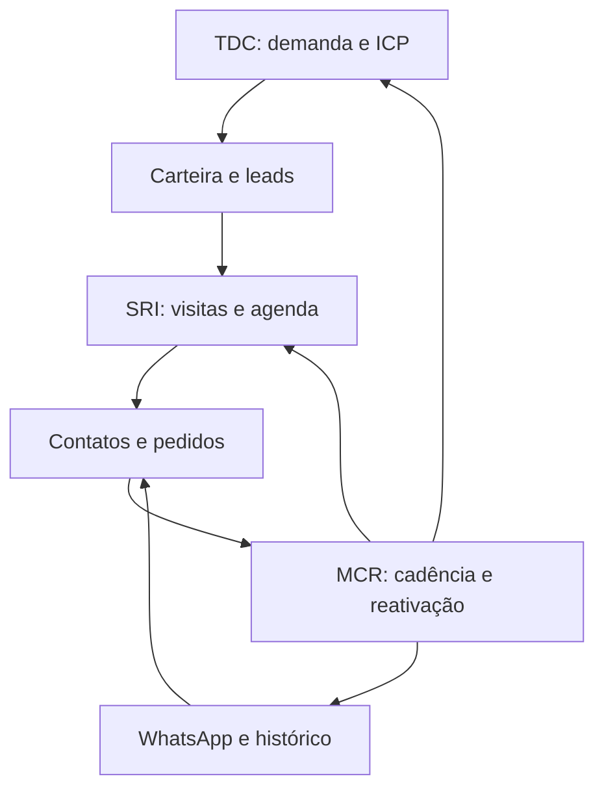

# L2 One — TDC, SRI e MCR

## Fluxo integrado

1. **TDC / Encontrar clientes:** qualificar demanda documentada e recente, CNPJ com dígitos verificadores válidos, UF PA/AP, canal, CNAE, porte, segmento, urgência e valor mensal estimado. Leads com pontuação >= 70 e CNAE compatível entram automaticamente na carteira. Sem qualificação, permanecem na fila de leads. A qualificação manual não certifica os dados da Receita: a consulta cadastral existente auxilia o preenchimento.
2. **SRI / Rota e visitas:** selecionar clientes da carteira autorizada na mesma cidade/UF, combinar prioridade comercial e deslocamento, respeitar abertura, fechamento, dias fechados, duração da visita e orçamento de retorno. Conferir a sugestão e criar visitas na agenda existente, com lembretes e previsão de despesas. Rotas existentes bloqueiam nova publicação no mesmo dia; a agenda nunca é substituída silenciosamente.
3. **MCR / Hoje e Visão 360:** recalcular carteira ativa, em risco, inativa ou sem histórico. Criar um lembrete semanal por cliente. Pedido confirmado/faturado/entregue, contato, cancelamento, arquivamento ou restauração recalculam cadência e prioridade. Alterar o cliente de um registro atualiza as duas carteiras afetadas.



## Regras e validações

- Evidência de demanda com até 30 dias, nunca futura. CNAE comercial compatível com o canal. Pontuação: compatibilidade 35; potencial mensal >= R$ 2.000 vale 20, demais 5; urgência <= 14 dias vale 25, demais 10; evidência <= 7 dias vale 20, demais 10. O porte e segmento ficam registrados para segmentação. Esses pesos são critérios operacionais iniciais, não uma probabilidade estatística de conversão.
- CNPJ é a identidade de deduplicação; duplicidade pré-existente exige revisão. Outra carteira permanece protegida. Dados derivados TDC/MCR e preferência de contato são preservados pelo servidor contra alterações pela fila de sincronização.
- Sem histórico de compras, nunca classificar como inativo. Em risco: >= 15 dias ou além do ciclo observado; inativo: >= 60 dias. Contato semanal. Três datas de compra permitem calcular a mediana dos intervalos, limitada a 7–180 dias. Sem amostra suficiente: ciclo padrão de 30 dias identificado na tela.
- Rascunhos, orçamentos, cancelados e registros futuros não contam como compra. A API fornece faturamento registrado, sem apresentá-lo como previsão de LTV. Há consulta de ciclos por marca; a cadência publicada é por cliente.
- Rota de 1–10 visitas, padrão 8. Sem coordenadas, cliente é listado como pendência; é possível salvar localização e horários na própria tela SRI. Fechamento padrão aos domingos, configurável. Horários contínuos no mesmo dia; intervalos de almoço e feriados excepcionais ainda não são modelados.
- O planejador é uma heurística. Usa Haversine, fator de percurso 1,4 e velocidade média de 25 km/h; **não é um trajeto rodoviário certificado**, não considera trânsito, balsas ou travessias. Percursos e custos são explicitamente estimados, incluindo retorno. A previsão de despesas gera tarefa de conferência, nunca lançamento financeiro real.
- Nenhuma página é recarregada por este módulo. As alterações usam a sincronização e as notificações de registros existentes. Ações estratégicas bloqueiam execução enquanto houver alterações locais não sincronizadas, evitando decisão sobre base desatualizada.

## Captação automática

Os endpoints existentes `/api/leads/webhook` e `/api/leads/intake` também qualificam automaticamente leads quando `customFields` contém todos os campos:

```json
{
  "channel": "Cosméticos", "cnae": "4772500", "size": "Pequena",
  "segment": "Maquiagem", "demandEvidence": "Comprador solicitou reposição por mensagem.",
  "evidenceDate": "2026-10-08", "urgencyDays": 7, "estimatedMonthlyValue": 3000
}
```

CNPJ, UF, cidade e contato vêm do cadastro do lead. Distribuição usa o vendedor atribuído pela captação existente, preservando o dono de clientes já cadastrados. Dados incompletos ficam aguardando qualificação; duplicatas de webhook não são reinjetadas. O TDC pesquisa a demanda **registrada no L2 One** por UF, segmento e urgência. Não há alegação de identificar demanda real de empresas externas sem fonte de dados/evidência. A fonte externa de descoberta ainda precisa ser conectada para prospecção de novas empresas fora da base.

## API por fase

| Fase | Endpoint | Resultado |
| --- | --- | --- |
| TDC | `POST /api/strategy/tdc/qualify` | Pontuação, lead e inclusão condicional na carteira |
| TDC | `GET /api/strategy/tdc/discover` | Busca por UF, segmento, canal e urgência; evidência expirada sinalizada |
| SRI | `PUT /api/strategy/sri/location/{client_id}` | Coordenadas, horários e dias fechados |
| SRI | `POST /api/strategy/sri/plan` | Prévia ou criação na agenda; `commit` explícito |
| MCR | `GET /api/strategy/overview` | Segmentação, prioridades, ciclos e sugestões de demanda |
| MCR | `POST /api/strategy/mcr/refresh` | Atualização idempotente de lembretes |
| MCR | `GET/PUT /api/strategy/mcr/settings` | Consulta e configuração da cadência |
| MCR | `PUT /api/strategy/mcr/consent/{client_id}` | Preferência de contato com evidência e autoria |
| MCR | `GET /api/strategy/mcr/history?client_id=...` | Tentativas e confirmação de envio/entrega/leitura disponíveis |

Todos exigem sessão e setor adequados. Escrita e leitura por cliente respeitam carteira. Ativação global de cadência apenas Ana Paula/Euler. As comissões continuam atribuídas ao vendedor responsável e ao percentual existente; o módulo não modifica a regra financeira.

## Persistência e execução

`strategic_crm.py` concentra regras, endpoints e projeções transacionais sobre `entities`. Identidades determinísticas de tarefas impedem duplicação. O índice PostgreSQL por tipo/clientId é criado de forma idempotente na inicialização. A atualização de cliente, lembrete e prioridade usa a mesma transação do pedido ou contato. Notificação é entregue após commit. Um bloqueio transacional coordena processamento com sincronização.

O worker no ciclo de vida FastAPI executa a cada minuto **enquanto o serviço está em execução**. Atualiza os lembretes na virada do dia e reserva até um envio por minuto. Bloqueio PostgreSQL e reserva persistida evitam repetição entre instâncias. Sem serviço ativo, a execução recupera os lembretes ao retornar; o plano gratuito pode suspender execução por inatividade. Garantia contínua de horários exige serviço sempre ativo/worker agendado, ainda não provisionado.

WhatsApp: configuração existente do provedor, modelo aprovado na Meta com duas variáveis no corpo (nome e segmento), idioma e autorização de contato do cliente. Padrão global **desativado**. Disparo de segunda a sexta, 09h–18h de Belém. Histórico distingue aceitação pela Meta e eventos de entrega/leitura. A reserva é gravada antes da chamada; timeout ou resposta ambígua fica para conferência, sem reenviar automaticamente. Não há promessas de entrega ou política de retry exatamente uma vez. Registro outbound é integrado ao chat Zara e ao histórico do CRM. Ligações são realizadas pelo responsável a partir dos lembretes, não por discador automático.

Modelo de API consultado: https://whatsapp.github.io/WhatsApp-Nodejs-SDK/api-reference/messages/template/

## Verificação e implantação

- 168 testes Python, incluindo qualificação, evidência, CNAE, estados de carteira, ciclo mediano, limites de rota, horários, retorno, isolamento, deduplicação, templates, autorização, falhas ambíguas e envio único.
- Testes JavaScript comerciais existentes; DOM com cinco perfis, formulários, payloads, escape de conteúdo e bloqueio da fila pendente.
- Verificação de sintaxe Python/JavaScript e de espaços em diffs.
- Testes de endpoints/worker usam dados e provedor simulados. Nenhum teste manda mensagem para um cliente real. A validação física WhatsApp e a simulação de campo permanecem dependentes dos dados reais e do modelo aprovado.

O bundle inclui os módulos em telas existentes e o cache PWA atualizado. Nenhum novo serviço pago é contratado. Rollback de código pode ser realizado ao commit anterior; o índice e dados derivados são aditivos e não removem registros existentes.
